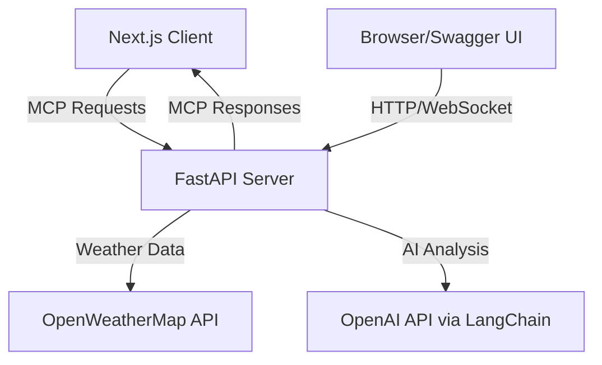

# 🌤️ MCP Weather Server - Complete Implementation Guide

> **A production-ready Model Context Protocol (MCP) server with comprehensive weather services, AI-powered insights, and professional documentation.**

[](https://mcp-server-production-3da3.up.railway.app/docs)
[](https://mcp-server-production-3da3.up.railway.app/docs)
[](https://railway.app)

---

## 📋 **Table of Contents**

- [🌟 Project Overview](#-project-overview)
- [🏗️ Architecture](#️-architecture)
- [🚀 Quick Start](#-quick-start)
- [⚙️ Environment Setup](#️-environment-setup)
- [🔧 Development Guide](#-development-guide)
- [📡 MCP Protocol Implementation](#-mcp-protocol-implementation)
- [🌍 Deployment Guide](#-deployment-guide)
- [📚 API Documentation](#-api-documentation)
- [🧪 Testing](#-testing)
- [🐛 Troubleshooting](#-troubleshooting)
- [🤝 Contributing](#-contributing)

---

## 🌟 **Project Overview**

This is a **complete, production-ready implementation** of the Model Context Protocol (MCP) featuring:

### **🌤️ Weather Services**
- **Real-time weather data** from OpenWeatherMap API
- **Multi-day forecasts** with detailed conditions
- **AI-powered insights** using LangChain and OpenAI
- **Travel advisories** and activity recommendations

### **🔌 MCP Protocol Compliance**
- ✅ **Full JSON-RPC 2.0** implementation
- ✅ **Standard MCP methods** (initialize, tools, resources, prompts)
- ✅ **WebSocket & HTTP** transport support
- ✅ **Error handling** with proper MCP response formats
- ✅ **Optional methods** (completion, notifications)

### **🏭 Production Features**
- 🚀 **Deployed on Railway** with auto-scaling
- 📊 **Comprehensive Swagger docs** with interactive examples
- 🔒 **CORS configuration** for cross-origin requests
- 📈 **Health monitoring** and status endpoints
- 🐳 **Container-ready** with Dockerfile support

---

## 🏗️ **Architecture**

```
📁 MCP Weather Project/
├── 🖥️ server/                    # Python FastAPI MCP Server
│   ├── main.py                   # Application entry point
│   ├── mcp_server.py             # Core MCP protocol implementation
│   ├── models.py                 # Pydantic models & schemas
│   ├── weather_service.py        # OpenWeatherMap integration
│   ├── langchain_integration.py  # AI insights & analysis
│   ├── requirements.txt          # Python dependencies
│   ├── railway.toml              # Railway deployment config
│   └── Procfile                  # Process configuration
├── 💻 client/                     # React Next.js Client
│   ├── app/                      # Next.js 13+ app directory
│   ├── components/               # React components
│   ├── lib/                      # MCP client library
│   ├── types/                    # TypeScript definitions
│   └── package.json              # Node.js dependencies
├── 📖 docs/                       # Documentation
└── 📄 README.md                   # This file
```

### **🔄 Data Flow**



---

## 🚀 **Quick Start**

### **⚡ Option 1: Use Deployed Server (Fastest)**

The MCP server is live and ready to use:

```bash
# 1. Clone the repository
git clone https://github.com/lshankarrao/mcp-server.git
cd mcp-server

# 2. Start the client
cd client
npm install
npm run dev

# 3. Open your browser
# Client: http://localhost:3000
# Server Docs: https://mcp-server-production-3da3.up.railway.app/docs
```

### **🛠️ Option 2: Full Local Development**

```bash
# 1. Set up the server
cd server
python -m venv venv
source venv/bin/activate  # On Windows: venv\Scripts\activate
pip install -r requirements.txt

# 2. Configure environment variables
cp .env.example .env
# Edit .env with your API keys (see Environment Setup)

# 3. Start the server
python main.py

# 4. Set up the client (in new terminal)
cd client
npm install

# 5. Configure client for localhost
echo "NEXT_PUBLIC_MCP_SERVER_URL=http://localhost:8000" > .env.local

# 6. Start the client
npm run dev
```

---

## ⚙️ **Environment Setup**

### **🔐 Required API Keys**

1. **OpenWeatherMap API Key** (for weather data)
   - Sign up at: https://openweathermap.org/api
   - Free tier: 1000 calls/day

2. **OpenAI API Key** (for AI insights)
   - Sign up at: https://platform.openai.com
   - Required for weather analysis features

### **📝 Server Environment Variables**

Create `server/.env` file:

```bash
# Weather API Configuration
OPENWEATHERMAP_API_KEY=your_openweather_api_key_here

# AI/LangChain Configuration  
OPENAI_API_KEY=your_openai_api_key_here

# Server Configuration (optional)
MCP_SERVER_HOST=0.0.0.0
MCP_SERVER_PORT=8000

# Railway Configuration (for deployment)
PORT=8000
RAILWAY_ENVIRONMENT=production
```

### **🖥️ Client Environment Variables**

Create `client/.env.local` file:

```bash
# MCP Server URL
NEXT_PUBLIC_MCP_SERVER_URL=http://localhost:8000

# For production deployment:
# NEXT_PUBLIC_MCP_SERVER_URL=https://mcp-server-production-3da3.up.railway.app
```

---

## 🔧 **Development Guide**

### **🐍 Server Development**

#### **Project Structure**
```
server/
├── main.py                 # FastAPI app creation & uvicorn server
├── mcp_server.py          # MCP protocol implementation
├── models.py              # Pydantic models for MCP & weather
├── weather_service.py     # Weather data fetching logic
├── langchain_integration.py # AI-powered insights
└── requirements.txt       # Python dependencies
```

#### **Key Classes**
- **`MCPServer`**: Main MCP protocol handler
- **`WeatherService`**: OpenWeatherMap API integration
- **`WeatherLangChainService`**: AI analysis using LangChain

#### **Running Tests**
```bash
cd server
python -m pytest tests/  # (if tests directory exists)
# Or test manually via Swagger UI: http://localhost:8000/docs
```

### **⚛️ Client Development**

#### **Project Structure**
```
client/
├── app/
│   ├── page.tsx           # Main weather app page
│   └── debug/page.tsx     # Environment debugging page
├── components/
│   ├── WeatherCard.tsx    # Weather data display
│   ├── MCPStatus.tsx      # Connection status indicator
│   └── ...
├── lib/
│   └── mcp-client.ts      # MCP protocol client
└── types/
    └── mcp.ts             # TypeScript definitions
```

#### **Key Components**
- **`MCPClient`**: MCP protocol communication
- **`WeatherCard`**: Weather data visualization
- **`MCPStatus`**: Real-time connection monitoring

#### **Development Commands**
```bash
cd client
npm run dev          # Development server
npm run build        # Production build
npm run start        # Production server
npm run type-check   # TypeScript validation
```

---

## 📡 **MCP Protocol Implementation**

### **🔌 Supported Methods**

| Method | Description | Parameters | Response |
|--------|-------------|------------|----------|
| `initialize` | Initialize MCP connection | `protocolVersion`, `capabilities`, `clientInfo` | Server capabilities & info |
| `tools/list` | List available weather tools | None | Array of tool definitions |
| `tools/call` | Execute weather tools | `name`, `arguments` | Tool execution results |
| `resources/list` | List weather resources | None | Array of resource definitions |
| `resources/read` | Read resource content | `uri` | Resource content |
| `prompts/list` | List AI prompt templates | None | Array of prompt definitions |
| `prompts/get` | Get prompt template | `name`, `arguments` | Prompt content |
| `completion/complete` | Auto-completion support | `argument` | Completion suggestions |
| `notifications/*` | Progress notifications | Varies | Acknowledgment |

### **🛠️ Available Weather Tools**

1. **`get_weather`**
   - **Purpose**: Current weather conditions
   - **Parameters**: `location` (required), `units` (optional)
   - **Example**: `{"location": "Paris", "units": "metric"}`

2. **`get_forecast`**
   - **Purpose**: Multi-day weather forecast
   - **Parameters**: `location` (required), `days` (optional, 1-7)
   - **Example**: `{"location": "London", "days": 5}`

3. **`get_weather_insights`**
   - **Purpose**: AI-powered weather analysis
   - **Parameters**: `location` (required), `activity` (optional)
   - **Example**: `{"location": "Tokyo", "activity": "outdoor hiking"}`

4. **`get_weather_summary_advisory`**
   - **Purpose**: Weather summary with travel advice
   - **Parameters**: `location` (required)
   - **Example**: `{"location": "New York"}`

### **📋 MCP Request Example**

```json
{
  "jsonrpc": "2.0",
  "id": 1,
  "method": "tools/call",
  "params": {
    "name": "get_weather",
    "arguments": {
      "location": "San Francisco",
      "units": "imperial"
    }
  }
}
```

### **📋 MCP Response Example**

```json
{
  "jsonrpc": "2.0",
  "id": 1,
  "result": {
    "content": [
      {
        "type": "text",
        "text": "Weather in San Francisco: Temperature: 65°F, Description: Partly cloudy, Humidity: 72%, Wind Speed: 8.5 mph"
      }
    ],
    "isError": false
  }
}
```

---

## 🌍 **Deployment Guide**

### **🚄 Railway Deployment (Current Setup)**

The server is deployed on Railway with automatic GitHub integration:

1. **Repository**: https://github.com/lshankarrao/mcp-server
2. **Live URL**: https://mcp-server-production-3da3.up.railway.app
3. **Auto-deploy**: Pushes to `master` branch trigger rebuilds

#### **Railway Configuration Files**
- **`railway.toml`**: Deployment settings
- **`Procfile`**: Process definition
- **`requirements.txt`**: Python dependencies

#### **Environment Variables in Railway**
```bash
OPENWEATHERMAP_API_KEY=your_key_here
OPENAI_API_KEY=your_key_here
PORT=8000
RAILWAY_ENVIRONMENT=production
```

### **🔄 Redeployment Process**

```bash
# 1. Make changes locally
git add .
git commit -m "Your changes"

# 2. Push to trigger Railway rebuild
git push origin master

# 3. Monitor deployment
# Check Railway dashboard or server logs
```

### **☁️ Alternative Deployment Options**

#### **Vercel (Client)**
```bash
cd client
npx vercel --prod
```

#### **Heroku (Server)**
```bash
cd server
heroku create your-mcp-server
git push heroku master
```

#### **Docker (Local/Cloud)**
```bash
# Create Dockerfile in server/
docker build -t mcp-weather-server .
docker run -p 8000:8000 mcp-weather-server
```

---

## 📚 **API Documentation**

### **📖 Interactive Documentation**

- **Swagger UI**: https://mcp-server-production-3da3.up.railway.app/docs
- **ReDoc**: https://mcp-server-production-3da3.up.railway.app/redoc
- **OpenAPI JSON**: https://mcp-server-production-3da3.up.railway.app/openapi.json

### **🔗 Key Endpoints**

| Endpoint | Method | Purpose | Documentation |
|----------|---------|---------|---------------|
| `/health` | GET | Server health check | Server status & MCP compliance |
| `/mcp` | POST | MCP protocol endpoint | All MCP method execution |
| `/mcp/methods` | GET | MCP method reference | Complete method documentation |
| `/mcp/ws` | WebSocket | Real-time MCP communication | WebSocket MCP protocol |
| `/docs` | GET | Swagger UI | Interactive API documentation |

### **🧪 Testing via Swagger**

1. Go to: https://mcp-server-production-3da3.up.railway.app/docs
2. Click "Try it out" on `/mcp` POST endpoint
3. Use provided examples:
   - Initialize MCP connection
   - List available tools
   - Call weather tools
   - Get AI insights

---

## 🧪 **Testing**

### **🔍 Manual Testing**

#### **Server Health Check**
```bash
curl https://mcp-server-production-3da3.up.railway.app/health
```

#### **MCP Protocol Test**
```bash
curl -X POST https://mcp-server-production-3da3.up.railway.app/mcp \
  -H "Content-Type: application/json" \
  -d '{
    "jsonrpc": "2.0",
    "id": 1,
    "method": "tools/list"
  }'
```

### **🖥️ Client Testing**

1. **Environment Debug Page**: http://localhost:3000/debug
2. **Main Application**: http://localhost:3000
3. **Browser Console**: Check MCP connection logs

### **🔧 Integration Testing**

Test the complete MCP flow:
1. Initialize connection
2. List tools
3. Call weather tool
4. Verify response format

---

## 🐛 **Troubleshooting**

### **🔍 Common Issues**

#### **Server Won't Start**
```bash
# Check Python version (3.11+ required)
python --version

# Install dependencies
pip install -r requirements.txt

# Check environment variables
cat .env

# Check port availability
lsof -i :8000  # On Unix/Mac
netstat -ano | findstr :8000  # On Windows
```

#### **Client Can't Connect to Server**
```bash
# Check server URL in .env.local
cat client/.env.local

# Verify server is running
curl http://localhost:8000/health

# Check CORS settings in mcp_server.py
```

#### **Weather Data Not Loading**
```bash
# Verify OpenWeatherMap API key
echo $OPENWEATHERMAP_API_KEY

# Test API key manually
curl "https://api.openweathermap.org/data/2.5/weather?q=London&appid=YOUR_API_KEY"
```

#### **AI Insights Not Working**
```bash
# Verify OpenAI API key
echo $OPENAI_API_KEY

# Check OpenAI API status
curl https://api.openai.com/v1/models -H "Authorization: Bearer YOUR_API_KEY"
```

### **📊 Debug Information**

#### **Server Logs**
- Railway: Check deployment logs in Railway dashboard
- Local: Server outputs logs to console

#### **Client Logs**
- Browser: Open Developer Tools → Console
- Debug page: http://localhost:3000/debug

#### **MCP Protocol Debugging**
- Use Swagger UI to test individual MCP methods
- Check JSON-RPC 2.0 format compliance
- Verify request/response structure

---

## 📈 **Performance & Monitoring**

### **⚡ Server Performance**
- **Railway Auto-scaling**: Handles traffic spikes automatically
- **Health Endpoint**: Monitor server status via `/health`
- **CORS Optimization**: Dynamic origin handling for production

### **🔍 Monitoring**
- **Railway Dashboard**: Deployment and resource monitoring
- **Application Logs**: Real-time server logs
- **Client Status**: Connection monitoring in UI

---

## 🛡️ **Security**

### **🔐 API Key Management**
- Environment variables only (never in code)
- Railway encrypted environment storage
- Separate keys for development/production

### **🌐 CORS Configuration**
- Development: Specific localhost origins
- Production: Dynamic origin handling
- No credentials with wildcard origins

### **🔒 Input Validation**
- Pydantic models for request validation
- Parameter sanitization
- Error handling without data exposure

---

## 📦 **Dependencies**

### **🐍 Server Dependencies**
```txt
fastapi>=0.100.0          # Web framework
uvicorn[standard]>=0.23.0  # ASGI server
pydantic>=2.4.0           # Data validation
httpx>=0.25.0             # HTTP client
langchain>=0.0.350        # AI framework
langchain-openai>=0.0.1   # OpenAI integration
python-dotenv>=1.0.0      # Environment loading
websockets>=11.0.0        # WebSocket support
typing-extensions>=4.7.0   # Type hints
```

### **⚛️ Client Dependencies**
```json
{
  "next": "14.0.0",
  "react": "18.0.0", 
  "typescript": "5.0.0",
  "@heroicons/react": "2.0.0",
  "tailwindcss": "3.0.0"
}
```

---

## 🔄 **Development Workflow**

### **📋 Making Changes**

1. **Create feature branch**:
   ```bash
   git checkout -b feature/your-feature-name
   ```

2. **Make changes and test locally**:
   ```bash
   # Server changes
   cd server && python main.py
   
   # Client changes  
   cd client && npm run dev
   ```

3. **Commit and push**:
   ```bash
   git add .
   git commit -m "feat: your descriptive message"
   git push origin feature/your-feature-name
   ```

4. **Deploy to production**:
   ```bash
   git checkout master
   git merge feature/your-feature-name
   git push origin master  # Triggers Railway auto-deploy
   ```

### **📋 Adding New MCP Methods**

1. **Add method to `models.py`**:
   ```python
   class MCPMethod(str, Enum):
       NEW_METHOD = "your/new_method"
   ```

2. **Implement handler in `mcp_server.py`**:
   ```python
   def handle_new_method(self, request: MCPRequest) -> MCPResponse:
       # Implementation here
       pass
   ```

3. **Add to request processor**:
   ```python
   elif request.method == "your/new_method":
       return self.handle_new_method(request)
   ```

4. **Update documentation in Swagger**

---

## 🤝 **Contributing**

### **🌟 How to Contribute**

1. **Fork the repository**
2. **Create a feature branch**
3. **Make your changes**
4. **Add tests if applicable**
5. **Update documentation**
6. **Submit a pull request**

### **📋 Contribution Guidelines**

- Follow existing code style
- Add comprehensive docstrings
- Update README for significant changes
- Test locally before submitting
- Include MCP protocol compliance

### **🐛 Reporting Issues**

When reporting issues, include:
- Server/client version
- Environment details (OS, Python/Node version)
- Steps to reproduce
- Error messages and logs
- Expected vs actual behavior

---

## 📜 **License**

MIT License - see LICENSE file for details.

---

## 🙏 **Acknowledgments**

- **Model Context Protocol**: Anthropic for the MCP specification
- **OpenWeatherMap**: Weather data API
- **OpenAI**: AI-powered insights
- **Railway**: Cloud deployment platform
- **FastAPI**: High-performance web framework
- **Next.js**: React framework for the client

---

## 📞 **Support & Contact**

- **Repository**: https://github.com/lshankarrao/mcp-server
- **Live Demo**: https://mcp-server-production-3da3.up.railway.app/docs
- **Issues**: Create GitHub issues for bugs/features

---

**🎉 You now have everything needed to understand, modify, and extend this MCP Weather Server!**

*This README serves as a complete guide for developers taking over or contributing to this project. Keep it updated as the project evolves.*